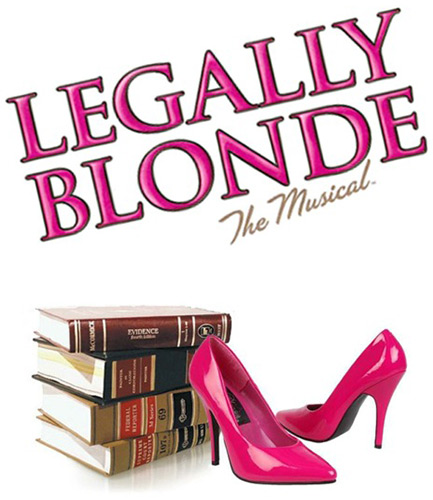

[>Back Home](../index.html)

## ~~Legally Blonde~~
[Legally Blonde at MTI](https://www.mtishows.com/legally-blonde-the-musical-jr)

### Synopsis:

> Based on the award-winning Broadway musical and the smash hit motion picture, Legally BlondeThe Musical JR. is a fabulously fun journey of self-empowerment and expanding horizons. The show's instantly recognizable songs are filled with humor, wit and sass — leaving cast members and audiences alike seeing pink!
>
> Legally Blonde JR. follows the transformation of Elle Woods as she tackles stereotypes, snobbery and scandal in pursuit of her dreams. When Elle's boyfriend, Warner, dumps her and heads to Harvard, claiming she's not "serious" enough, Elle takes matters into her own hands, crafting a showy song-and-dance personal essay and charming her way into law school. Befriending classmate, Emmett, and spunky hairdresser, Paulette, along the way, Elle finds that books and looks aren't mutually exclusive.  As Elle begins outsmarting her peers, she realizes that law may be her natural calling after all.
>
> Legally Blonde JR. features large, energetic dance numbers with an expandable cast of sorority sisters, law school students, hairdressers and more.

### Suggested by:
Ashley

### Show Breakdown:
34+ Roles
