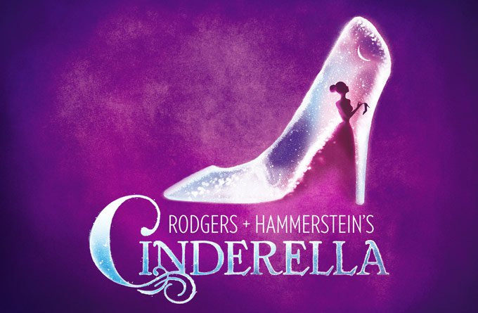

[>Back Home](../index.html)

## ~~Cinderella~~
[Cinderella at RNH](https://www.rnh.com/show/22/Cinderella)

### Synopsis:

> The timeless enchantment of a magical fairy tale is reborn with the Rodgers & Hammerstein hallmarks of originality, charm and elegance. Originally presented on television in 1957 starring Julie Andrews, Rodgers & Hammerstein's CINDERELLA was the most widely viewed program in the history of the medium. Its recreation in 1965 starring Lesley Ann Warren was no less successful in transporting a new generation to the miraculous kingdom of dreams-come-true, and so was a second remake in 1997, which starred Brandy as Cinderella and Whitney Houston as her Fairy Godmother. As adapted for the stage, with great warmth and more than a touch of hilarity, the hearts of children and adults alike still soar when the slipper fits.
>
### Suggested by:
Ashley Owen

### Show Breakdown:
14+ Roles
