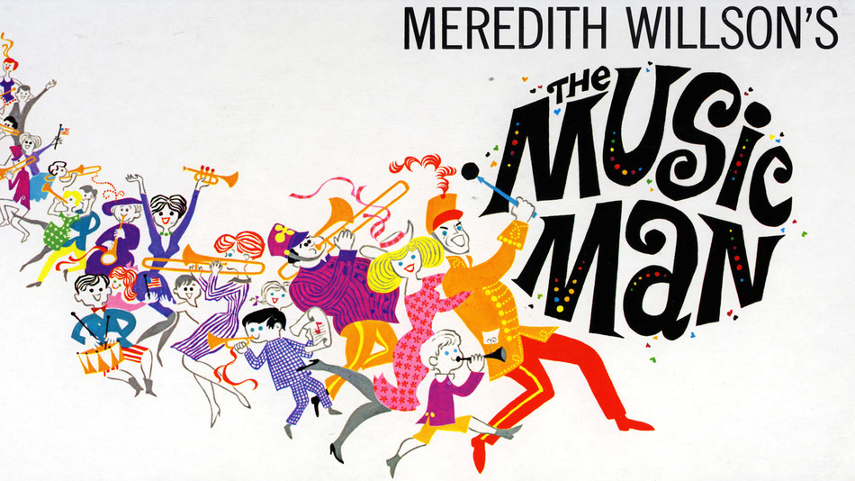

[>Back Home](../index.html)

## Music Man
[Music Man at MTI](https://www.mtishows.com/the-music-man)

### Synopsis:

> By turns wicked, funny, warm, romantic and touching, The Music Man is family entertainment at its best. Meredith Willson's six-time, Tony Award-winning musical comedy has been entertaining audiences since 1957 and is a family-friendly story to be shared with every generation.
>
> The Music Man follows fast-talking traveling salesman, Harold Hill, as he cons the people of River City, Iowa, into buying instruments and uniforms for a boys' band that he vows to organize – this, despite the fact that he doesn't know a trombone from a treble clef. His plans to skip town with the cash are foiled when he falls for Marian, the librarian, who transforms him into a respectable citizen by curtain's fall.
>
> Perfect for professional theatres, community groups, summer stock and schools alike, this award-winning, critically acclaimed Broadway classic is an all-American institution, thanks to is quirky characters, charmingly predictable dramatic situations and one-of-a-kind, nostalgic score of rousing marches, barbershop quartets and sentimental ballads, which have become popular standards. The cast features a soaring soprano ingenue, parts for young performers and children, and one of the musical theatre's treasures, a tour de force leading role for a charismatic actor who doesn't need to be a trained singer.

### Suggested by:
Multiple Burrato and Owen

### Show Breakdown:
13+ Roles
