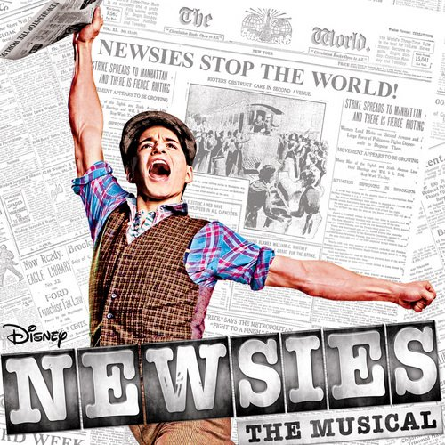

[>Back Home](../index.html)

## Newsies
[Newsies at MTI](https://www.mtishows.com/newsies-0)

### Synopsis:

> It's time to carry the banner on your stage with Disney's Newsies! Set in turn-of-the century New York City, Newsies is the rousing tale of Jack Kelly, a charismatic newsboy and leader of a band of teenaged "newsies." When titans of publishing raise distribution prices at the newsboys’ expense, Jack rallies newsies from across the city to strike against the unfair conditions and fight for what's right!
>
> Based on the 1992 motion picture and inspired by a true story, Newsies features a Tony Award-winning score by Alan Menken (Little Shop of Horrors, Sister Act) and Jack Feldman and a book by Tony Award winner Harvey Fierstein (Kinky Boots). Featuring the now classic songs “Carrying the Banner,” “Seize the Day,” and “Santa Fe,” Newsies is packed with non-stop thrills and a timeless message, perfect for the whole family and every audience.

### Suggested by:
Anna

### Show Breakdown:
9+ Roles
